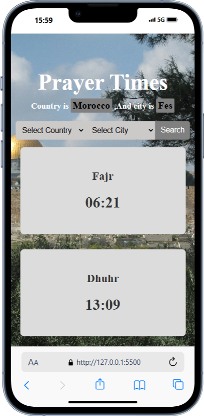
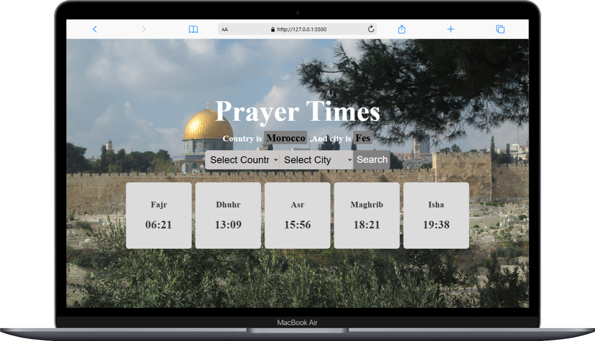
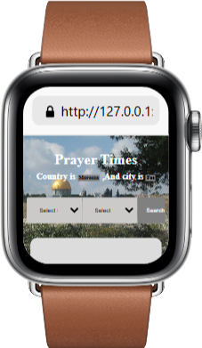

# Prayer Times App

This is a **Prayer Times** app that allows users to view the Islamic prayer times based on their location. The app uses a reliable API to fetch the prayer times and provides users with a simple and intuitive interface to see the times for **Fajr**, **Dhuhr**, **Asr**, **Maghrib**, and **Isha**.

It is designed to be responsive and work across different devices, ensuring that users can always check prayer times, whether they are on their desktop or mobile device.

## Features

- **Prayer Times by Location**: The app allows users to select their country and city to display the prayer times.
- **Real-Time Updates**: The prayer times are fetched dynamically, ensuring they are always up-to-date.
- **Responsive Design**: The app adapts to any screen size, providing an optimal experience on both desktops and mobile devices.
- **Call to Prayer Notification**: The app plays an audio notification when a prayer time arrives.

## Screenshots

# Mobile

# pc

# watch

